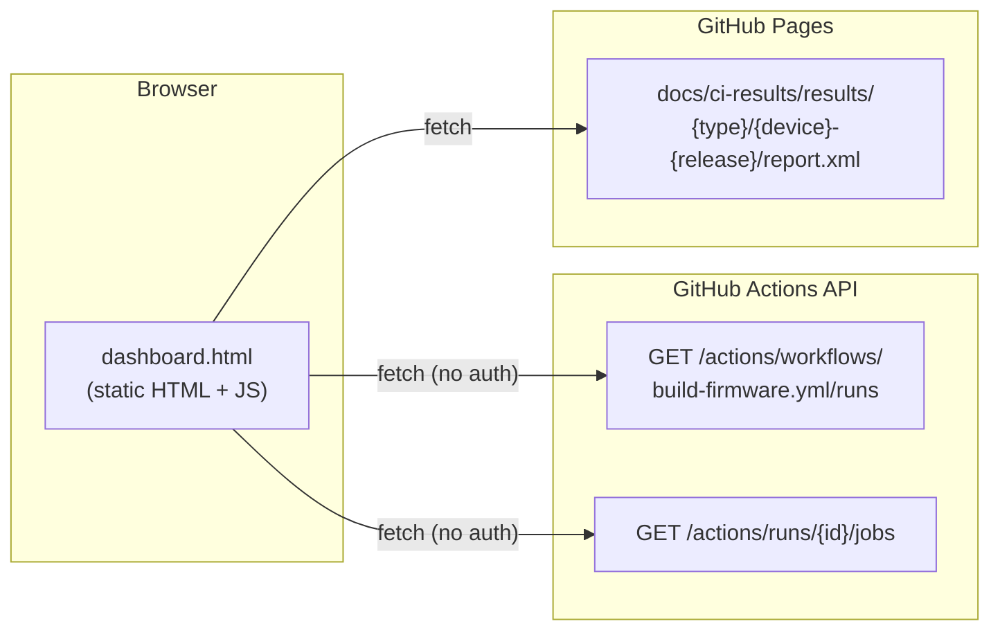

# Dashboard Architecture

The dashboard is a fully static page — no backend, no database. All data is fetched client-side at load time from two sources.

## Data sources

### Source 1 — GitHub Actions REST API

Used for: **job status, run history, duration, links**.

- Endpoint: `https://api.github.com/repos/fcefyn-testbed/lime-packages/actions/...`
- No authentication required (public repo)
- Rate limit: 60 requests/hour per IP (unauthenticated)
- Job names are parsed to extract device, place, and release:
  `test-firmware (belkin_rt3200_1 / 24.10.6)` → place=`belkin_rt3200_1`, release=`24.10.6`

### Source 2 — Published `report.xml` files

Used for: **per-test-case breakdown** (pass / fail / skip counts and individual test names).

- Served from GitHub Pages alongside `dashboard.html`
- JUnit XML format, generated by pytest (`--junitxml`)
- Published automatically after each scheduled CI run by the `publish-results` job in `build-firmware.yml`
- Path convention: `results/{type}/{identifier}/report.xml`

## Request flow

1. Page loads → JS fetches last 10 workflow runs from GitHub API
2. For each run, fetches the job list (parallel requests)
3. Parses job names → builds a map of `{id → entry}` with run history
4. Renders cards immediately with API data
5. In parallel, attempts to fetch each `report.xml` from Pages
6. Cards that have a `report.xml` update to show test case details
