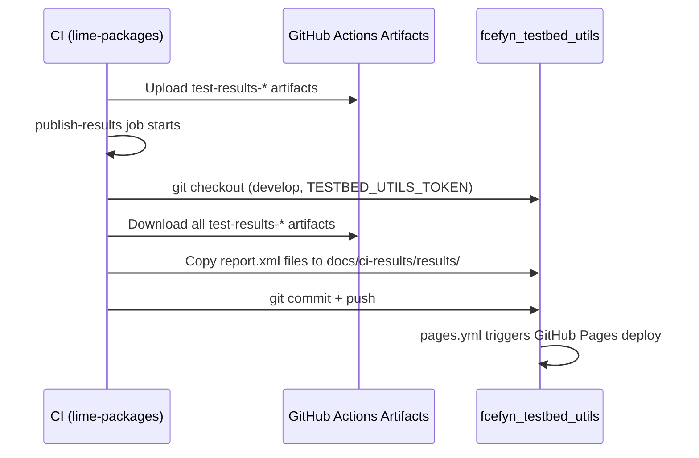

# Publishing Test Results

Test results are published automatically to this repository after each scheduled CI run in `lime-packages`. Once published, the dashboard shows individual test case details instead of "Test details not yet published".

## How it works

The `publish-results` job in `lime-packages/.github/workflows/build-firmware.yml` runs after all test jobs complete on the daily schedule (`0 6 * * *`):



## Results directory structure

```
docs/ci-results/results/
├── devices.json                                    # device registry
├── physical/
│   ├── belkin_rt3200_1-24.10.6/
│   │   └── report.xml
│   ├── belkin_rt3200_2-24.10.6/
│   │   └── report.xml
│   ├── belkin_rt3200_3-24.10.6/
│   │   └── report.xml
│   ├── bpi_r4_1-24.10.6/
│   │   └── report.xml
│   ├── openwrt_one_1-24.10.6/
│   │   └── report.xml
│   ├── belkin_rt3200_1-25.12.2/
│   │   └── report.xml
│   ├── belkin_rt3200_2-25.12.2/
│   │   └── report.xml
│   ├── belkin_rt3200_3-25.12.2/
│   │   └── report.xml
│   ├── bpi_r4_1-25.12.2/
│   │   └── report.xml
│   └── openwrt_one_1-25.12.2/
│       └── report.xml
├── qemu-single/
│   ├── qemu_x86_64-24.10.6/
│   │   └── report.xml
│   └── qemu_x86_64-25.12.2/
│       └── report.xml
└── qemu-mesh/
    ├── qemu_x86_64-24.10.6/
    │   └── report.xml
    └── qemu_x86_64-25.12.2/
        └── report.xml
```

## Required secret

The publish pipeline requires a fine-grained PAT stored as `TESTBED_UTILS_TOKEN` in `lime-packages` repository secrets, with `Contents: Read and write` permission on this repository.

## Triggering manually

To publish results outside the daily schedule, trigger `build-firmware.yml` via `workflow_dispatch` — the `publish-results` job runs after the test jobs complete.
