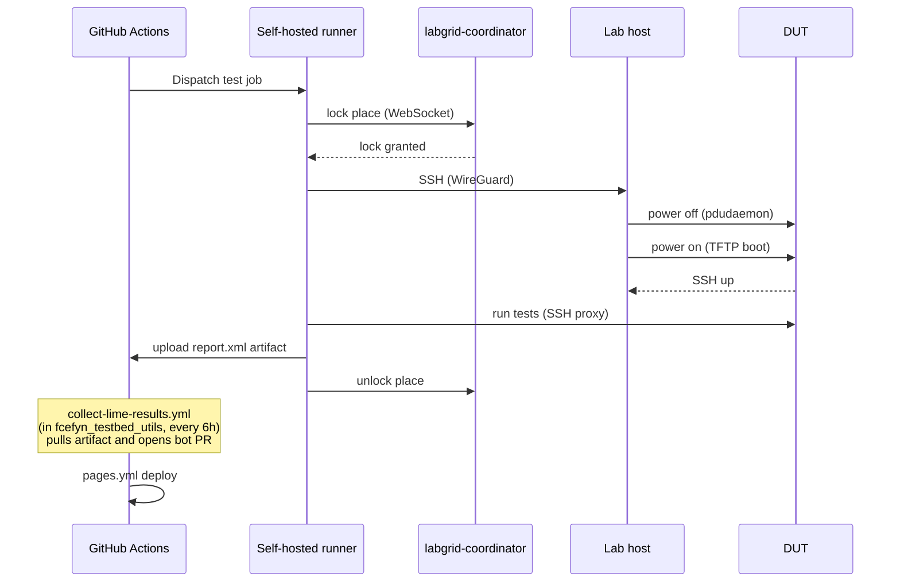

# Full test run flow

End-to-end walkthrough of what happens between a CI trigger and a result appearing in the dashboard. Covers both physical DUT tests and virtual mesh tests.

## Physical DUT test run

### 1. Trigger

A push to `lime-packages` (or a scheduled daily run) fires `build-firmware.yml` on GitHub Actions. The workflow builds LibreMesh firmware for each target and then launches a test job per device/release combination.

```
push → build-firmware.yml → build matrix → test matrix
```

### 2. Runner picks up the job

A self-hosted runner on the datacenter VM (`labgrid-fcefyn`) picks up the test job. The runner has WireGuard connectivity to the lab host.

### 3. Labgrid reserves the DUT

```python
# pytest plugin calls at session start
labgrid-client lock --place labgrid-fcefyn-belkin_rt3200_1
```

The coordinator checks no other job holds the lock. If the place is busy, the job waits (up to the configured timeout).

### 4. Power cycle + TFTP boot

The test fixture:

1. Cuts power to the DUT via `pdudaemon` → Arduino relay
2. Sets the TFTP symlink to point to the initramfs image
3. Restores power — DUT starts, U-Boot fetches the kernel via TFTP
4. Waits for SSH to come up on the DUT (VLAN 200 after LibreMesh boot, or VLAN 100 for OpenWrt)

```
power off → TFTP symlink set → power on → DHCP → TFTP → kernel loads → SSH up
```

### 5. Tests run

pytest runs the test modules against the DUT via SSH through `labgrid-bound-connect`:

```
pytest → SSH ProxyCommand → labgrid-bound-connect → socat → DUT eth0 (VLAN 200)
```

Each test function connects, runs commands, asserts results.

### 6. Results collected

pytest generates a JUnit XML report (`--junitxml report.xml`) and uploads it as a GitHub Actions artifact (`test-results-PLACE-RELEASE`).

### 7. Results pulled into the dashboard

There is no publish step inside `lime-packages`. Instead, the
`collect-lime-results.yml` workflow in `fcefyn_testbed_utils` runs every
6 h (or on `workflow_dispatch`) and:

1. Lists recent runs of `build-firmware.yml` (and `tests.yml`) via the
   GitHub Actions REST API, using `LIME_PACKAGES_TOKEN`
2. Downloads each `test-results-*` artifact and extracts `report.xml`
3. Maps the artifact name to the dashboard's expected path
   (`docs/ci-results/results/{type}/{identifier}/report.xml`)
4. Opens an auto-merged bot PR onto `develop` with `BOT_PR_TOKEN`
   (`peter-evans/create-pull-request` + `gh pr merge --auto --squash`)
5. `pages.yml` deploys the updated site to GitHub Pages

See [Publishing results](../ci-results/publishing.md) for the full
diagram and required secrets.

### 8. Dashboard updates

Next time someone opens the dashboard, the new `report.xml` is fetched from Pages and the card re-renders with per-test-case details.

---

## Virtual mesh test run

### 1. Trigger

`virtual-mesh.yml` is triggered by push or daily schedule. It runs on `ubuntu-latest` (GitHub-hosted) — no physical hardware needed.

### 2. Setup

The job installs QEMU and builds/downloads vwifi-server, then:

```bash
vwifi-server &
# launch N VMs in parallel, wait for SSH on each
```

### 3. Mesh formation

Each VM boots LibreMesh, `vwifi-client` connects to `10.0.2.2:9090`, `mac80211_hwsim` radios become visible across VMs, batman-adv and babeld form the mesh (~30s).

### 4. Tests run

```bash
MESH_NODES=3 uv run pytest tests/mesh/ -v
```

The test suite connects to each VM via `ssh -p PORT root@127.0.0.1` and validates mesh state.

### 5. Results

pytest JUnit XML → uploaded as artifact → optionally published to Pages (same pipeline as physical results).

---

## Sequence diagram (physical)


